# 🎬 CineSwipe — Flutter App
### Swipe-to-Discover Movie Recommendation App

CineSwipe is a Flutter app that turns movie discovery into a card-swiping game.
Swipe a deck of movie cards in **four directions** — **right** to save to your
watchlist, **left** to skip, **up** to mark as watched, **down** to set aside as
unwatched — all powered by live data from
[The Movie Database (TMDB)](https://www.themoviedb.org/). Your lists persist on
device and can be backed up to the cloud and restored on any device.

## Screenshots

<p align="center">
  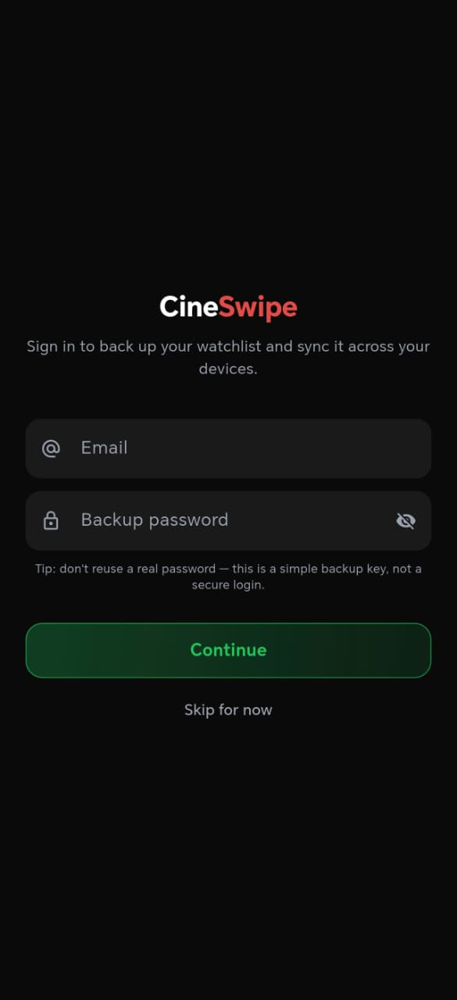
  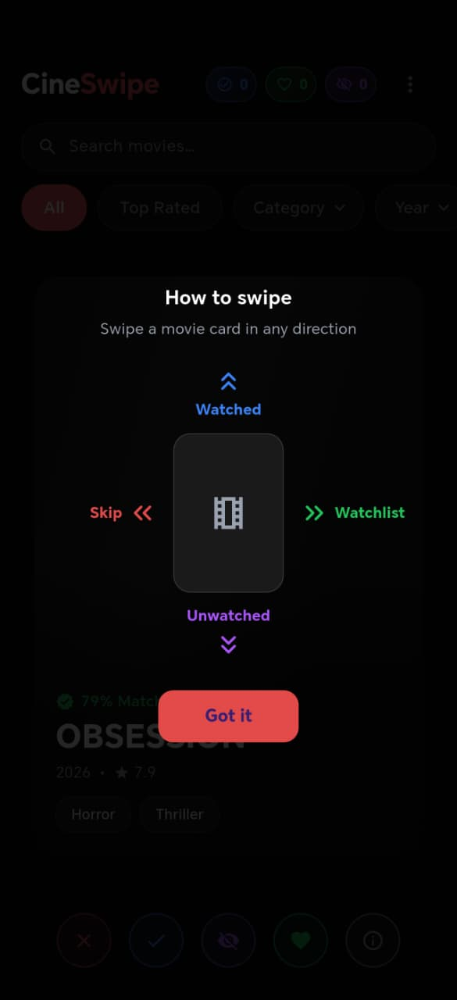
  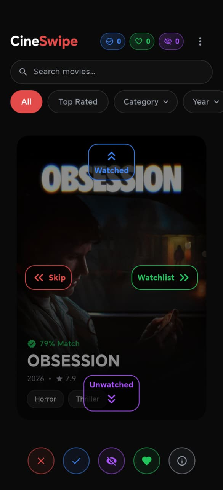
  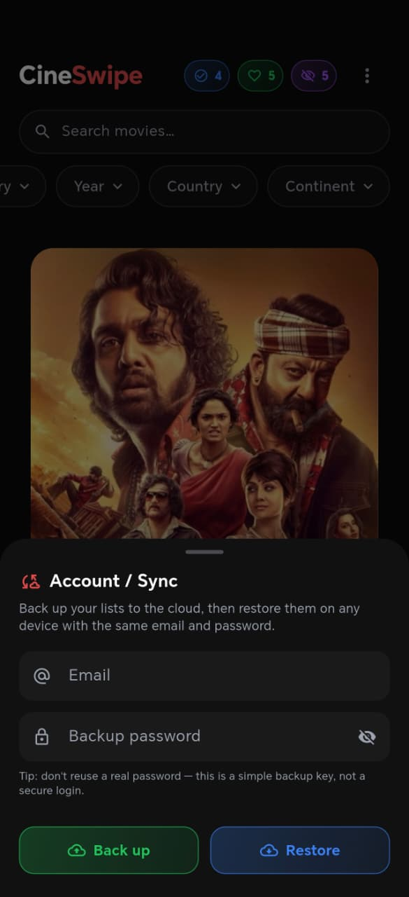
  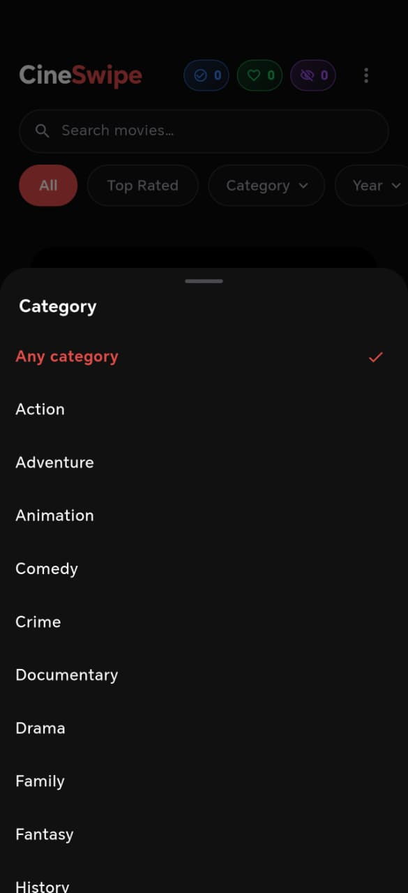
  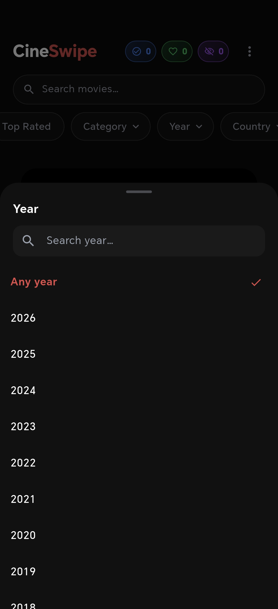
</p>
<p align="center">
  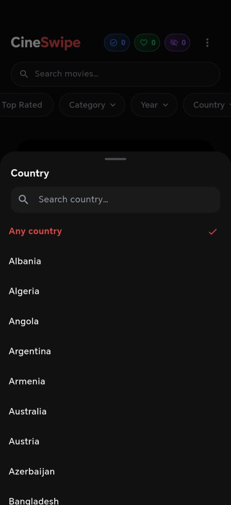
  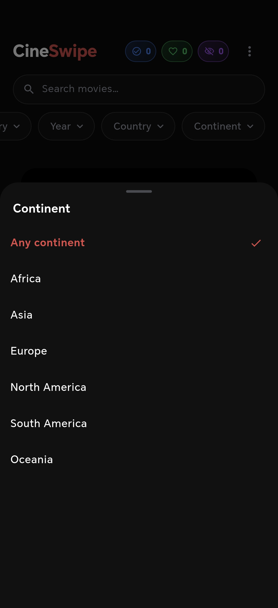
  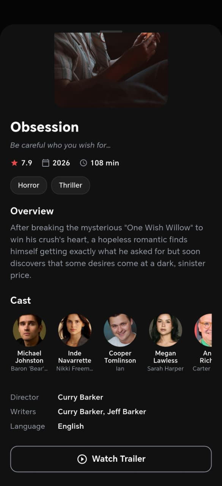
  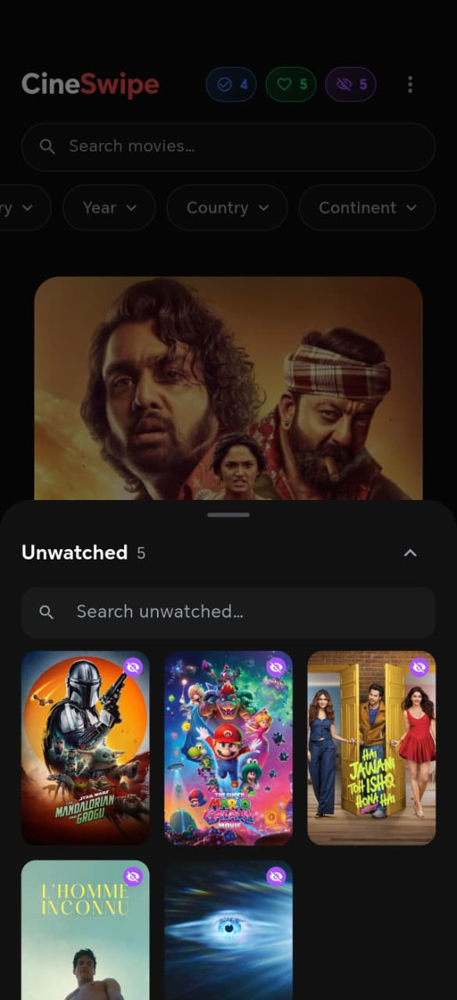
  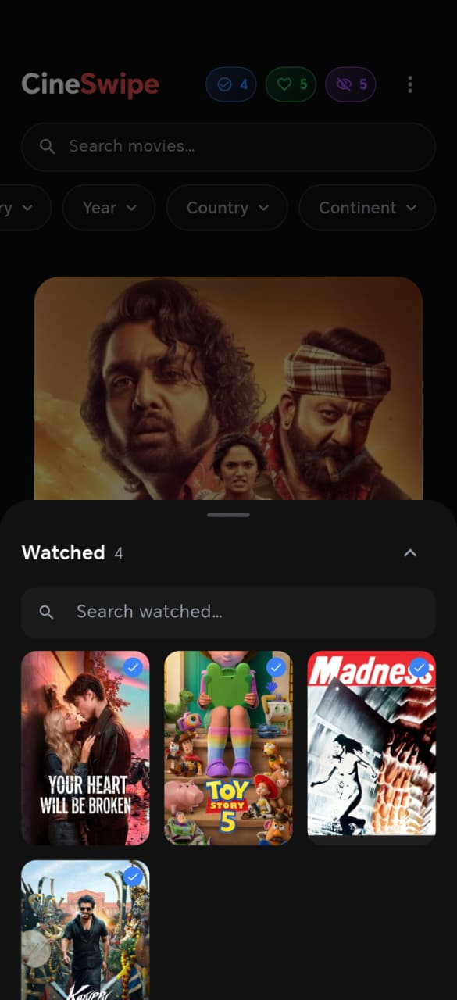
  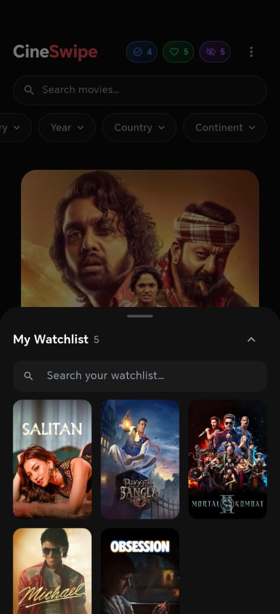
</p>

## Features

| Feature              | Detail                                                                                       |
| -------------------- | -------------------------------------------------------------------------------------------- |
| Four-way swipe deck  | Drag-to-swipe cards with rotation, fly-off animation, and spring snap-back — right = Watchlist, left = Skip, up = Watched, down = Unwatched |
| Action buttons       | Skip ✕, Watched ✓, Unwatched 🙈, Watchlist ❤, and Info ℹ for programmatic swipes             |
| Watchlist / Watched / Unwatched | Three mutually-exclusive, disk-persisted lists, each with a slide-up sheet, live count pill, tap-to-open and remove |
| Smart deck           | Movies you've swiped any direction won't resurface (a "seen" set), with infinite pagination de-duplicated by id |
| Filter bar           | Combine **Top Rated**, **Category** (genre), **Year**, **Country**, and **Continent** filters; region picking is hierarchical (country ↔ continent) |
| Search               | Look up any title by name — search ignores the "seen" set so you can always find a movie |
| Movie detail sheet   | Draggable sheet with hero poster, overview, cast, director/writers, runtime, rating, trailer, "where to watch" providers, and "More like this" recommendations |
| Onboarding guide     | One-time "how to swipe" overlay (re-openable from the ? button) showing the four swipe directions |
| Cloud backup & sync  | Back up your lists to a Vercel + Blob backend and restore them on any device, keyed by an email + password hash |
| Loading shimmer      | Shimmer placeholder cards while posters load, with an emoji fallback                          |
| Polish               | Haptics, empty-deck state, error + retry states, cached network images                        |
| Cinematic theme      | Pure-black Material 3 palette with a warm red accent                                          |

## Project structure

```
movie_recommendation/
  lib/
    main.dart                          ← Bootstrap: load .env, ProviderScope
    app.dart                           ← MaterialApp + theme
    core/
      constants.dart                   ← Colors, text styles, API + sync config, genres
      theme.dart                       ← Dark ThemeData definition
      providers.dart                   ← Service & repository providers
      filter_options.dart              ← Genre / year / country / continent option data
    data/
      models/
        movie.dart                     ← Movie list model + (de)serialization
        movie_detail.dart              ← Full detail (cast, crew, videos, providers, recs)
      services/
        tmdb_service.dart              ← TMDB API calls via dio
        sync_service.dart              ← Cloud backup HTTP + sha256 key derivation
      repositories/
        movie_repository.dart          ← Routes to popular / top_rated / search / discover
        watchlist_repository.dart      ← shared_preferences persistence
        watched_repository.dart        ← shared_preferences persistence
        unwatched_repository.dart      ← shared_preferences persistence
        seen_repository.dart           ← "already swiped" id set
        onboarding_repository.dart     ← one-time onboarding flag
        account_repository.dart        ← local backup credentials
        sync_repository.dart           ← builds / applies the cloud bundle
    features/
      discovery/
        discovery_screen.dart          ← Top bar + filter bar + swipe deck
        providers/                     ← movies_provider, filter_provider, search_provider, seen_provider
        widgets/                       ← swipe_card, card_stack, action_buttons,
                                         filter_bar, filter_picker_sheet, search_bar
      watchlist/                       ← providers/ + widgets/ (sheet, grid)
      watched/                         ← providers/ + widgets/ (sheet)
      unwatched/                       ← providers/ + widgets/ (sheet)
      detail/
        widgets/movie_detail_sheet.dart
      onboarding/                      ← providers/ + widgets/ (overlay)
      account/                         ← providers/ + widgets/ (account/sync sheet)
    shared/
      widgets/                         ← shimmer_card, poster_image, sheet_search_field
  backend/
    api/data.js                        ← Vercel serverless backup/restore (Blob-backed)
  assets/
    images/cineswipe_logo.png          ← Source image for the launcher icon
  screenshots/                         ← App screenshots used in this README
```

## Setup

### 1. Install dependencies

```bash
flutter pub get
```

### 2. Add your TMDB API key

This app reads the API key from a `.env` file in the project root.

1. Create a free account at [themoviedb.org](https://www.themoviedb.org/).
2. Go to **Settings → API** and request a key:
   <https://www.themoviedb.org/settings/api>
3. Copy `.env.example` to `.env` and paste your key:

   ```bash
   cp .env.example .env
   ```

   ```env
   TMDB_API_KEY=your_tmdb_api_key_here
   # Optional — base URL of your cloud-sync backend (see "Cloud sync backend").
   SYNC_BASE_URL=https://your-deployment.vercel.app
   ```

> The `.env` file is declared as a Flutter asset in `pubspec.yaml`, so it is
> bundled into the app at build time. It is gitignored — do **not** commit your
> real key or backend URL.

### 3. (Optional) Regenerate launcher icons

```bash
dart run flutter_launcher_icons
```

### 4. Run

```bash
flutter run
```

### Cloud sync backend (optional)

Cloud backup/restore talks to a tiny Vercel serverless function backed by Vercel
Blob storage. The backend URL is read at runtime from the `SYNC_BASE_URL` entry
in your `.env` (the `/api/data` endpoint is appended); leave it blank to disable
cloud sync. To deploy your own, see [`backend/README.md`](backend/README.md) and
set `SYNC_BASE_URL` to your deployment.

## How it works

### Swipe flow

```
Movie deck (TMDB, filtered)
         │
         ▼
  User drags a card
  ├── swipe right → Watchlist
  ├── swipe left  → Skip
  ├── swipe up    → Watched
  ├── swipe down  → Unwatched
  └── tap card / Info ℹ → MovieDetailSheet
         │
         ▼
  Every swiped movie is marked "seen" (won't resurface)
         │
         ▼
  Deck runs low → fetch next page (de-duplicated by id)
```

Watchlist, Watched, and Unwatched are **mutually exclusive** — moving a movie to
one list removes it from the others.

### Local persistence

```
shared_preferences
  cineswipe_watchlist_v1   → Watchlist movies
  cineswipe_watched_v1     → Watched movies
  cineswipe_unwatched_v1   → Unwatched movies
  cineswipe_seen_v1        → ids already swiped (deck filter)
  cineswipe_onboarding_seen_v1 → onboarding shown?
  cineswipe_account_v1     → local backup credentials (never synced)
         │
         ▼
  Repositories ← load / save
         │
         ▼
  Riverpod notifiers  (sheets rebuild on change)
```

### Filters

```
Filter chip tapped (Top Rated / Category / Year / Country / Continent)
         │
         ▼
  movieFilterProvider updates the combined MovieFilter
         │  routes to /movie/top_rated or /discover/movie (with_genres,
         │  primary_release_year, with_origin_country)
         ▼
  moviesProvider fetches a fresh deck
```

### Cloud backup & sync

```
email + password
         │  sha256("email:password")  ← opaque backup key (crypto)
         ▼
  SyncService  →  POST/GET  $SYNC_BASE_URL/api/data?id=<key>
         │                         (Vercel function, Blob-backed JSON)
         ▼
  Bundle: watchlist, watched, unwatched, seen ids, onboarding flag
         │
         ▼
  Restore overwrites all local lists (same email + password ⇒ same data anywhere)
```

There's no real authentication — the email + password are only hashed into a
storage key, so a wrong password simply yields a different key ("no backup
found"). Don't reuse a real password.

## Key dependencies

| Package                  | Purpose                                            |
| ------------------------ | -------------------------------------------------- |
| `flutter_riverpod`       | State management                                   |
| `dio`                    | HTTP client for TMDB API and cloud sync            |
| `cached_network_image`   | Poster image caching                               |
| `shared_preferences`     | Persist lists across app restarts                  |
| `crypto`                 | SHA-256 hashing of email + password into the backup key |
| `flutter_dotenv`         | Load the TMDB API key from `.env`                  |
| `url_launcher`           | Open trailers and "where to watch" links           |
| `shimmer`                | Loading placeholder animations                     |
| `flutter_launcher_icons` | Adaptive launcher icon generation                  |

## Design

Pure-black cinematic theme (`#0A0A0A`) with a red accent (`#E24B4A`) and a
green save color (`#22C55E`). See `lib/core/constants.dart` for the full palette.

## Troubleshooting

- **"Missing TMDB API key" / 401 error** — confirm `.env` exists in the project
  root, contains `TMDB_API_KEY=...`, and re-run `flutter pub get` then a full
  restart (hot reload won't re-bundle assets).
- **No images** — check network connectivity; posters load from `image.tmdb.org`.
- **"No backup found" on restore** — the email + password must match exactly what
  you backed up with (the password is case- and whitespace-sensitive); a mismatch
  hashes to a different key.

## Building a release APK

For an APK you can **share with anyone**, build the universal APK (contains all
CPU ABIs, so it runs on every Android phone):

```bash
flutter build apk --release
```

Output: `build/app/outputs/flutter-apk/app-release.apk` — this is the file to send
to people.

> **Don't distribute `--split-per-abi` APKs casually.** Each split APK contains
> native code for only one CPU architecture. If you send someone an APK whose ABI
> doesn't match their phone, it installs but **crashes instantly on launch**
> (the Flutter engine can't load). `flutter run` hides this because it auto-picks
> the matching split. For the Play Store, prefer an App Bundle
> (`flutter build appbundle`) — Google serves each device the right ABI.

### Note on R8 / code shrinking

R8 (release-only code shrinking) is **disabled** in `android/app/build.gradle.kts`
(`isMinifyEnabled = false`, `isShrinkResources = false`). With it enabled, R8
stripped `androidx.startup.R$string` and the app crashed at launch
(`NoClassDefFoundError` in `InitializationProvider`, before Flutter even started)
— release-only, showing just the logo for a second. If you re-enable R8 for a
smaller build, add a keep rule: `-keep class androidx.startup.** { *; }`.
